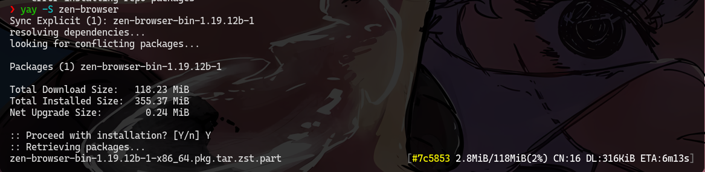
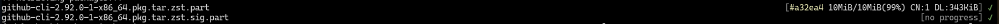

# aria2c-fmt

A clean and formatted `aria2c` wrapper for `pacman`.
You wanna download fast but also has nice output? aria2c-fmt is your answer

## Preview




````

---

## Features

* Clean single-line progress output
* Colored progress formatting
* Works with pacman `XferCommand`
* Uses `aria2c` for parallel downloading
* Lightweight pure Bash script
* Minimal terminal clutter

---

## Requirements

* Bash
* aria2

Install aria2:

```bash
sudo pacman -S aria2
```

---

## Installation

```bash
chmod +x install.sh
./install.sh
```

---

## Uninstall

```bash
chmod +x remove.sh
./remove.sh
```

---

## Manual Setup

Add this to `/etc/pacman.conf`:

```ini
XferCommand = /path/to/aria2c-fmt -x 16 -s 16 -k 1M -d / -o %o %u
```

---

## Usage

Pacman will automatically use the formatter during downloads:

```bash
sudo pacman -Syu
```

---

## Notes

* Designed specifically for pacman
* Uses `aria2c` internally
* Supports standard aria2 arguments
* Download speed and connections can be customized in `pacman.conf`
````

## LICENSE

WTFPL (Do What The Fuck You Want To)
